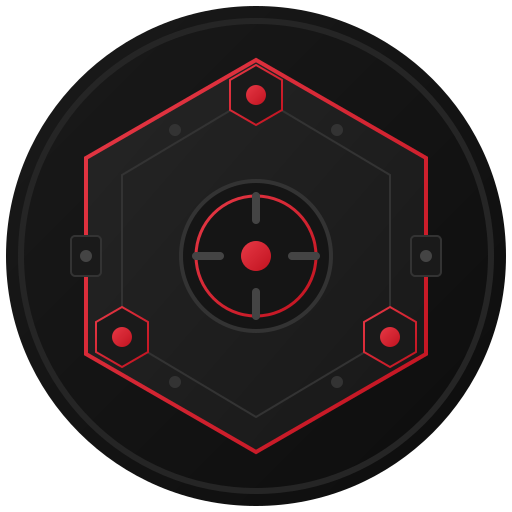
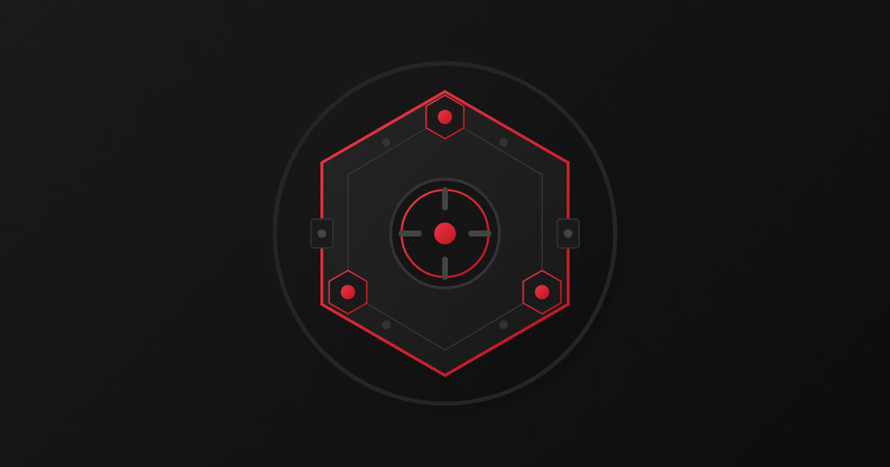

<p align="center">
  
</p>

<h1 align="center">Quai Vault</h1>

<p align="center">
  <strong>Decentralized multisig wallet infrastructure for the Quai Network.</strong>
</p>

<p align="center">
  <a href="https://testnet.quaivault.org"></a>
  <a href="https://github.com/Quai-Vault"></a>
  <a href="https://github.com/Quai-Vault/quaivault-contracts"></a>
</p>

<br />

<p align="center">
  
</p>

<br />

Quai Vault is an open-source multisig wallet system designed for secure, multi-owner treasury management across Quai Network's sharded architecture. It brings Zodiac-compatible smart account infrastructure to Quai, enabling DAOs, teams, and institutions to manage assets with configurable approval thresholds, native timelocks, token support, and full on-chain transparency.

> **Not a Safe clone.** QuaiVault is a purpose-built multisig with hash-based unordered transactions, integrated timelocks, epoch-based approval invalidation, Option B failure handling, and DelegateCall hardening. See the full [technical comparison](https://github.com/Quai-Vault/quaivault-contracts/blob/main/QUAIVAULT_VS_GNOSIS_SAFE.md).

---

## Repositories

| | Repository | Description | Stack |
|:---:|---|---|---|
|  | [**quaivault-contracts**](https://github.com/Quai-Vault/quaivault-contracts) | Smart contracts — multisig wallet, factory, proxy, and social recovery module | Solidity 0.8.22 · Hardhat · OpenZeppelin v5 |
|  | [**quaivault-frontend**](https://github.com/Quai-Vault/quaivault-frontend) | Wallet management dApp — create, propose, approve, execute transactions | React 18 · Vite 7 · quais.js · Zustand · TanStack Query · wagmi · Zod |
|  | [**quaivault-indexer**](https://github.com/Quai-Vault/quaivault-indexer) | Blockchain event indexer — real-time tracking of all vault activity | TypeScript · Supabase · Docker · quais.js |
|  | [**quaivault-www**](https://github.com/Quai-Vault/quaivault-www) | Marketing site and documentation hub | React 19 · Vite 7 · Three.js · Tailwind CSS 4 |

---

## Architecture

```
┌──────────────────────────────────────────────────────────────────┐
│                         Users & DAOs                             │
├──────────────┬───────────────────────────────────┬───────────────┤
│  quaivault-  │       quaivault-frontend          │  quaivault-   │
│  www         │       Wallet Management dApp      │  www          │
│  Marketing   │  Create · Propose · Approve ·     │  Docs &       │
│  & Landing   │  Execute · Timelocks · Recovery   │  Guides       │
├──────────────┴──────────────┬────────────────────┴───────────────┤
│                             │                                    │
│                    quaivault-indexer                              │
│   Real-time event indexing · Supabase · Token auto-discovery     │
│   Circuit breaker · Health checks · Reorg detection              │
│                             │                                    │
├─────────────────────────────┴────────────────────────────────────┤
│                    quaivault-contracts                            │
│  QuaiVault · Factory · Proxy · SocialRecovery · MultiSend       │
│  Hash-based TXs · Native timelocks · Zodiac IAvatar · CR-1      │
├──────────────────────────────────────────────────────────────────┤
│                        Quai Network                              │
│             Cyprus · Paxos · Hydra (9 shards)                    │
└──────────────────────────────────────────────────────────────────┘
```

---

## Key Features

<table>
<tr>
<td width="50%" valign="top">

### Multisig Wallet
- **1-of-N to M-of-N** thresholds with up to 20 owners
- **5-state lifecycle** — pending, executed, cancelled, expired, failed
- **Hash-based transaction IDs** — unordered, parallel execution
- **CREATE2** deterministic, shard-aligned deployment
- **DelegateCall hardening (CR-1)** — disabled by default, opt-in for trusted modules

</td>
<td width="50%" valign="top">

### Native Timelocks & Expiration
- **Vault-level + per-transaction** execution delays
- **Clock-gaming protection** — permanent `approvedAt` timestamp
- **Self-call bypass** — admin ops execute immediately
- **Per-transaction expiry** with permissionless cleanup

</td>
</tr>
<tr>
<td width="50%" valign="top">

### Token & Signature Support
- **ERC-20 / ERC-721 / ERC-1155** — native receivers built-in
- **EIP-1271** contract signatures via multisig consensus
- **ERC-165** interface detection for all standards

</td>
<td width="50%" valign="top">

### Zodiac & Modules
- **[IAvatar](https://github.com/gnosis/zodiac)** standard — compatible with the full Zodiac ecosystem
- **Social Recovery** — guardian-based with configurable recovery period and expiration
- **MultiSend** for batched atomic transactions
- **Up to 50 modules** per vault with linked-list storage

</td>
</tr>
<tr>
<td width="50%" valign="top">

### Indexer
- **30+ event types** with token auto-discovery
- Circuit breaker, reorg detection, graceful shutdown
- Kubernetes-ready (`/health`, `/ready`, `/live`)
- Multi-network schemas (testnet/mainnet isolation)

</td>
<td width="50%" valign="top">

### Frontend dApp
- **Pelagus + WalletConnect** via Reown AppKit
- **6 transaction modes** — QUAI, ERC-20, ERC-721, ERC-1155, contract calls, EIP-1271 message signing
- Indexer-first reads with blockchain RPC fallback
- Social recovery & module management UI

</td>
</tr>
</table>

---

## Smart Contracts

<table>
<tr><td><b>QuaiVault (Implementation)</b></td><td><code>0x0006bFD36432079e4E813E383A8FD60f7a131388</code></td></tr>
<tr><td><b>QuaiVaultFactory</b></td><td><code>0x00613Bd358C36Bed84bf64A9F1bC632d3125779b</code></td></tr>
<tr><td><b>SocialRecoveryModule</b></td><td><code>0x000a01324137F3DC737017479e7c61F87b90d217</code></td></tr>
<tr><td><b>MultiSend</b></td><td><code>0x00465B948541CE357ea54BD3C3d8B9995097d199</code></td></tr>
</table>

<sub>Deployed on Quai Network Orchard Testnet — Cyprus1 (chain ID 15000)</sub>

---

## Security

- **OpenZeppelin v5** battle-tested libraries with **ReentrancyGuard** on all paths
- **Hash-based replay protection** with chain ID and vault address binding
- **Epoch-based approval invalidation** — owner removal invalidates all their approvals in O(1)
- **Option B failure handling** — failed external calls are terminal, never stuck
- **Immutable wallets** — ERC1967 constructor proxies, no upgrade path
- **DelegateCall hardening (CR-1)** — module DelegateCall blocked by default, opt-in only
- **4 audit rounds** completed — 0 Critical, 0 High, 0 Medium findings remaining
- **398 tests** (345 unit + 53 E2E) covering wallet, factory, timelocks, expirations, tokens, recovery, modules, and Zodiac compliance

<p align="center">
  <br />
  <a href="https://github.com/Quai-Vault/quaivault-contracts/blob/main/QUAIVAULT_VS_GNOSIS_SAFE.md"></a>
  <a href="https://github.com/Quai-Vault/quaivault-contracts/blob/main/TRANSACTION_LIFECYCLE_DESIGN.md"></a>
  <a href="https://github.com/Quai-Vault/quaivault-contracts/blob/main/SECURITY_GUIDE.md"></a>
</p>

---

## Getting Started

<p align="center">
  <a href="https://testnet.quaivault.org"></a>
  <a href="https://quaivault.org/docs"></a>
</p>

```bash
# Clone all repositories
git clone https://github.com/Quai-Vault/quaivault-contracts.git
git clone https://github.com/Quai-Vault/quaivault-frontend.git
git clone https://github.com/Quai-Vault/quaivault-indexer.git
git clone https://github.com/Quai-Vault/quaivault-www.git

# Smart contracts
cd quaivault-contracts && npm install
npm test                    # 345 unit tests
npm run test:e2e            # 53 on-chain E2E tests

# Indexer
cd ../quaivault-indexer && npm install
cp .env.example .env && npm run dev

# Frontend
cd ../quaivault-frontend && npm install
cp .env.example .env && npm run dev    # http://localhost:5173

# Marketing & docs
cd ../quaivault-www && npm install
npm run dev                             # http://localhost:5174
```

---

## How It Works

1. **Create a Vault** — Deploy via the factory with owners, threshold, optional timelock, and DelegateCall policy
2. **Propose Transactions** — Any owner submits a proposal with optional expiration and per-transaction timelock
3. **Gather Approvals** — Owners review and approve; the indexer tracks confirmations in real time
4. **Wait for Timelock** — If set, the transaction becomes executable after the delay elapses from quorum
5. **Execute** — Once threshold is met and any timelock has elapsed, any owner executes on-chain
6. **Extend with Modules** — Enable Social Recovery for guardian-based wallet recovery, or MultiSend for batched operations

---

## Contributing

Contributions are welcome. Please open an issue or submit a pull request in the relevant repository.

---

<p align="center">
  
  <br />
  <sub>MIT License</sub>
</p>
